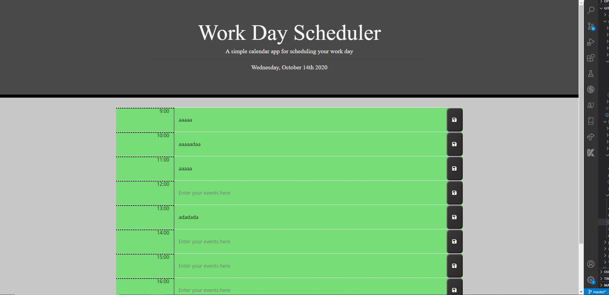

# 05_weekday_planner

<a href="http://tonycrosby.net/05_weekday_planner/" target="_blank"></a>

> This is an Event planner for the current day to save information and use it to keep your day scheduled and in order it's also formatted in military time because thats the time I always have used.

### > To get to the Repository <a target="_blank" href="https://github.com/tonycrosby-tech/05_weekday_planner"> Click this link </a>

### > To get to the Website <a target="_blank" href="https://tonycrosby-tech.github.io/05_weekday_planner/"> Click this link </a>

#

# Technologies used

> HTML, Javascript, Bootstrap, Jquery

# Direction for future development

> Would like to improve the functionality of it. To then go and schedule other days ahead of time, and to do that I would use a button that moves the day forward.

# Acceptance Criteria

```
GIVEN I am using a daily planner to create a schedule
WHEN I open the planner
THEN the current day is displayed at the top of the calendar
WHEN I scroll down
THEN I am presented with time blocks for standard business hours
WHEN I view the time blocks for that day
THEN each time block is color-coded to indicate whether it is in the past, present, or future
WHEN I click into a time block
THEN I can enter an event
WHEN I click the save button for that time block
THEN the text for that event is saved in local storage
WHEN I refresh the page
THEN the saved events persist
```
## Thanks for checking out my planner

### Tony Crosby
